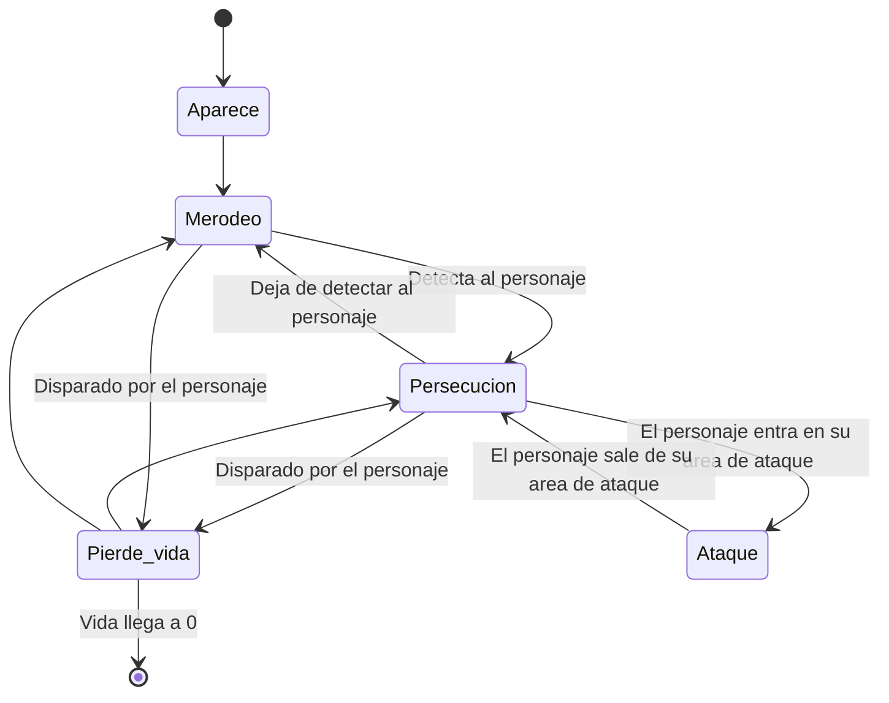
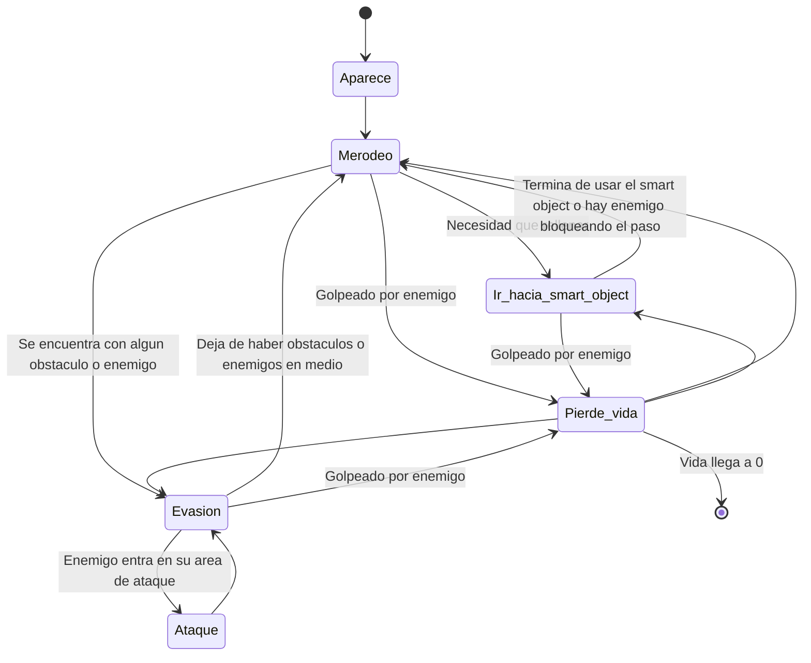

# IAV24 Proyecto final (Enchanted town) (¡¡CORREGIR DE NUEVO!!)
[Gameplay del proyecto](https://youtu.be/7Y0oKYcR5YA)

## Índice
- [Autores](#autores)
- [Propuesta](#propuesta)
    - [Elementos](#elementos)
        - [Mundo](#mundo)
        - [Personaje](#personaje)
        - [Objetos](#objetos)
        - [Enemigos](#enemigos)
        - [Interfaz](#interfaz-de-usuario)
    - [Apartados](#apartados)
        - [Apartado A](#apartado-a-matt)
        - [Apartado B](#apartado-b-matt)
        - [Apartado C](#apartado-c-pedro)
        - [Apartado D](#apartado-d-pedro)
        - [Apartado E](#apartado-e-matt)
        - [Ampliaciones](#ampliaciones)
- [Punto de partida](#punto-de-partida)
- [Diseño de la solución](#diseño-de-la-solución)
    - [Solución A](#solución-a)
    - [Solución B](#solución-b)
    - [Solución C](#solución-c)
    - [Solución D](#solución-d)
    - [Solución E](#solución-e)
- [Pruebas y métricas](#pruebas-y-métricas)
    - [Prueba A](#prueba-a)
    - [Prueba B](#prueba-b)
    - [Prueba C](#prueba-c)
    - [Prueba D](#prueba-d)
    - [Prueba E](#prueba-e)
- [Ampliaciones realizadas](#ampliaciones-realizadas)
- [Producción](#producción)
- [Licencia](#licencia)
- [Referencias](#referencias)
    - [Assets](#assets)
    - [Herramientas](#herramientas)
    - [Insipraciones](#inspiraciones)
    - [Programación](#programación)

## Autores
- Matt Castellanos ([MattCastUCM](https://github.com/MattCastUCM))
- Pedro León ([P4179](https://github.com/P4179))

## Propuesta

Este proyecto forma parte de la asignatura de Inteligencia Artificial para Videojuegos del Grado en Desarrollo de Videojuegos de la UCM.

El proyecto consiste en un ***life simulator***, en el que el protagonista deberá ir satisfaciendo sus necesidades a través de la interacción con distintos objetos. El ambiente está basado en un pueblo medieval, en el que nuestro protagonista, un mago, debe hacer su día a día, ya sea alimentándose y durmiendo, o tratando de sobrevivir a hordas de enemigos que invadirán el pueblo. 

En este contexto se pretende implementar el uso de **árboles de comportamiento**, con los que el personaje decide qué hacer y adónde ir en cada momento, y de ***smart objects***, que indican al personaje qué es lo que tiene que hacer con ellos.

El objetivo principal es sobrevivir el mayor números de días posibles. Para ello, el protagonista tiene que atender a sus necesidades y evitar el daño de los enemigos. De lo contrario, irá perdiendo vida y si llega a 0, perderá.

### Elementos

De forma más detallada, el contenido del juego se puede dividir en los siguientes apartados:

#### Mundo
Hay un mundo virtual (pueblo medieval) con un esquema de división de malla navegación donde sucede toda la acción descrita anteriormente.

Además, como se ha indicado, el juego está dividido en días. Cada día dispone de un ciclo de día y noche en el que, durante la mañana, el personaje debe cubrir sus necesidades, mientras que por la noche tiene tanto que huir de los enemigos, como seguir cubriendo sus necesidades.

#### Personaje
El personaje se desplaza alrededor del mapa usando la navegación automática programada con un árbol de comportamiento. En su movimiento trata de realizar sus tareas diarias (mantener sus necesidades altas) y elimina a los enemigos que amenazan el pueblo. Dispone de un área de percepción que le permite conocer los enemigos que tiene a su alrededor y actuar en consecuencia.

Para enfrentarse a los enemigos, utiliza su poder mágico. Cada punto de poder mágico equivale a un proyectil y cuando un enemigo entra en su radio de acción de lucha y tiene poder disponible, lo dispara y lo elimina. Sin embargo, los enemigos también pueden contraatacar y si entran en contacto con él, le inflingen daño. Otra forma de que pierda vida es si no atiende sus necesidades y llegan a cero.

Las necesidades que tiene son las siguientes:
- Hambre: baja de forma pasiva.
- Sed: baja de forma pasiva.
- Energía: baja de forma pasiva. Durante la noche esta bajada es mucho mayor.

#### Objetos
Existen diferentes objetos interactuables del entorno, que le permiten al personaje aumentar alguno de sus parámetros. Están programados como *smart objects* y ninguno de ellos es consumible. Además, para utilizarlos se requiere de un tiempo. Los elementos disponibles son los siguientes:
- Víveres: reducen el hambre del personaje. A pesar de que todos los objetos de este tipo tienen la misma apariencia visual, cada uno ofrece un número diferente de puntos.
- Barriles: reducen la sed del personaje. A pesar de que todos objetos de este tipo tienen la misma apariencia visual, cada uno ofrece un número diferente de puntos.
- Torre del personaje: aumenta la energía del personaje completamente. El personaje se mete dentro de la torre a descansar y no puede sufrir daño. Sin embargo, si hay muchos enemigos alrededor del edificio, no puede seguir durmiendo por el ruido y sale de la torre.
- Libro del mago
    - Inicialmente todos los libros están cerrado y debe abrirlos para activar su poder mágico
    - Una vez abiertos, puede utilizarlos para recargar su poder. Cada uno ofrece un número diferente de puntos.

#### Enemigos
Los enemigos aparecen en los límites del poblado durante la noche. Su movimiento sencillo está programa a través de un árbol de comportamiento. Consiste en merodear por todo el mapa hasta encontrarse con el personaje. Entonces, lo persiguen. Sin embargo, si este sale de su área de detección, dejan de perseguirlo y vuelven a merodear.

Los enemigos mueren de una bola de poder y realizan cierto daño al personaje al entrar en contacto con él.

#### Interfaz de usuario
- FPS y controles: arriba a la derecha. Se usa para testear el juego más adelante.
- Día actual: arriba en el centro.
- Vida del personaje: arriba a la izquierda. Está representado con una barra.
- Poder mágico: arriba a la izquierda debajo de la vida. Está representado con un número, que indica el número de bolas de poder que todavía puede lanzar el personaje.
- Necesidades: se muestran en la parte inferior de la pantalla en forma de barras: hambre, sed y energía.
- Flujo de interacciones: Encima de la barra de energía. Indica qué interacción de que *smart object* se está realizando.


### Apartados

Una vez explicados todos los elementos del juego, siguiendo el [guión del proyecto](https://narratech.com/es/docencia/prueba/), se estructura de la siguiente manera:

#### Apartado A (Matt)
Hay un **mundo virtual** (el pueblo) con un esquema de división por **malla de navegación** generado con la herramienta ***AI Navigation*** de Unity, en el que se encuentran todos los elementos descritos anteriormente. La cámara se puede acercar y alejar usando la rueda del ratón, mover dentro de ciertos límites arrastrando mientras se presiona `click izquierdo`, y reiniciar la posición y zoom haciendo `click derecho`. 

#### Apartado B (Matt)
Hay un **ciclo de día y noche** con el que se van contando los días que lleva vivo el personaje. El sol irá saliendo y poniéndose según la hora del día, y por la noche aparecerán **enemigos** cada cierto tiempo a las afueras del pueblo.

#### Apartado C (Pedro)
El personaje cuenta con una **barra de vida**, que disminuirá si los enemigos entran en contacto con él. Por otro lado, también cuenta con **poder mágico**, que le permitirá **dispararle** a los enemigos que se acerquen a él a cierta distancia. El **poder mágico** restante estará indicado por el número restante de proyectiles que puede disparar. Se activa y se recarga usando un ***smart object***.

#### Apartado D (Pedro)
El personaje cuenta con unas **necesidades**, indicando qué tan satisfechas están mediante unas barras. Estas barras se van vaciando con el tiempo, por lo que tendrá que usar los ***smart objects*** correspondientes para satisfacerlas. Si es de noche, la barra de energía se vaciará más rápidamente, y el personaje no podrá dormir si hay demasiados enemigos cerca de la torre.

#### Apartado E (Matt)
Tanto los enemigos como los personajes están controlados por **árboles de comportamiento** complejos, programados mediante ***Behavior Designer***. El personaje tratará de huir de los enemigos que se acerquen a él, evadiéndolos tanto a ellos como a los obstáculos del mapa. Por otro lado, los enemigos merodearán por el mapa hasta que encuentren con la vista al personaje, comenzando a perseguirlo una vez lo detecten y volviendo a merodear si lo pierde. Además, el **árbol de comportamiento** del personaje **se comunicará con sus necesidades**, que le harán saber qué ***smart objects*** debe utilizar para satisfacerlas para posteriormente acercarse a ellos y usarlos.

#### Ampliaciones
- Existen grupos de enemigos que realizan su movimiento correspondiente, pero en vez de ir en solitario, van en grupo, en bandada.
- Movimiento manual con el clic derecho usando la malla de navegación.
- Se puede asignar “objetos” a los *smart objects*, de modo que cuando el personaje los utiliza, selecciona uno y sirven como multiplicadores para la estadística base del *smart object*.
- A partir de los objetos cogidos (descritos en el punto anterior), el personaje crea una memoria de corto plazo y una permanente.

<br>

## Punto de partida
Se parte de un proyecto de Unity 2022.3.5.f1 proporcionado por el profesor que contiene la herramienta ***[Behavior Designer](https://assetstore.unity.com/packages/tools/visual-scripting/behavior-designer-behavior-trees-for-everyone-15277)***, que sirve para crear árboles de comportamiento.
Los árboles de comportamiento surgen como una mejora de las máquinas finitas de estados. Representan la ejecución de un plan (secuencia de acciones) y consiste en un árbol binario dirigido con un nodo raíz, nodos de control de flujo y nodos de ejecución (tareas). Los nodos principales de flujo son:
- Nodo selector: tiene éxito cuando uno de los hijos tiene éxito. Prueba de izquierda derecha.
- Nodo secuencia: tiene éxito cuando todos los hijos tienen éxito. Se ejecutan de izquierda a derecha.

<br>

## Diseño de la solución

### Solución A
La creación del mundo se ha hecho en dos partes. Mientras que el terreno se ha creado con la herramienta Tiles de Unity, los objetos del pueblo, tanto los que funcionan como obstáculos como los interactuables, se han dispuesto de forma estratégica para que el personaje no realiza sus tareas en un intervalo de tiempo ni muy corto ni muy largo. Luego, se ha configurado la malla de navegación, que representa el terreno real por el que pueden caminar los enemigos y el personaje.

Además, se ha utilizado un borde para los objetos interactuables para que el usuario pueda reconocerlos fácilmente y conozca perfectamente lo que está haciendo el personaje.


### Solución B
El `LevelManager` es el gestor encargado de:
- Ciclo de día y noche &rarr; para hacer un cambio visual, se hace que la luz cambie de color según un grandiente y que gire alrededor del mundo como si de un sol se tratase, de modo que las sombras cambian de posición dependiendo de la hora del día.
- Spawn de los enemigos &rarr; existen varios puntos en los que que a partir de una horas establecidas en el día aparecen los tipos de enemigos asignados. Además, se lleva un conteo de los enemigos que hay en el mapa para que no se generen más si ya hay demasiados.

### Solución C
Este apartado está dividido en varias partes:
- Vida: toda su lógica se encuentra en la clase `PlayerHealth`. El personaje puede ver su vida reducida tanto porque las necesidades están bajas como porque sufre daño del enemigo, el cual funciona por proximidad a través de un collider. Además, para que no pueda sufrir daño de un mismo enemigo en el mismo frame tiene un tiempo de gracia.
- Poder mágico: el poder mágico representa el número de balas que tiene el personaje. Para saber su funcionamiento hay que hablar de dos características:
- Disparo: el personaje dispara por proximidad. Cuando tiene balas y hay un enemigo a su alrededor, lanza un raycast hacia él para saber que no hay ningún obstáculos y en el caso de que no lo haya, le dispara un proyectil mágico.
- Libro del mago: funciona como un *smart object*, cuyo estructura se explica más abajo. Tiene dos interacciones:
- Abrirlo: inicialmente el personaje comienza sin su poder mágico y para conseguirlo debe abrir todos los libros. Existe un *BookManager*, que registra los personaje que han abierto algún libro y una vez abierto todos, activa el poder mágico de cada uno. Aunque nuestro juego tenga un único personaje, se ha decidido hacer de esta manera porque queda muy bien con la estructura generalista de los *smart object* que permite añadir más de un jugador al juego fácilmente.
- Cargar poder: se trata de una interacción cuyo resultado se consigue una vez ha completado e incrementa el poder mágico en un cierto número de puntos

### Solución D
Antes de explicar la resolución que se ha propuesto en cada uno de los *smart objects* en particular, conviene explicar su estructura:

Los *smart objects* es un patrón de diseño que surgió en *SimAnt* y posteriormente se trasladó a la saga de *The Sims* debido a un problema que tenían que resolver, permitir que un usuario pueda interactuar con una gran cantidad de objetos sin que su código crezca demasiado y sea fácilmente escalable. Es así como surgen este tipo de objetos que contienen gran parte de la información sobre como el personaje debe realizar una tarea (interacción) o que cambios producen en él, como el tipo que tarda en realizarla, que estadísticas cambian, que habilidades se activan, que acción una vez realizada ya no puede volver a ejecutar...

La estructura de un *smart object* se asemeja en parte a la estructura objetos-componentes, pues, aunque se puede modificar para añadir atributos común a todas las interacciones, el *smart object* no es más que un contenedor de interacciones, cada una de las cuales contiene información sobre que personaje están realizandola, cuánto tarda (instántanea, durante el tiempo o después de un tiempo) y que cambios son los que realiza sobre el personaje.

Es imposible hablar de los *smart objects* sin hablar de las estadísticas (en el juego existen cuatro: poder mágico, energía, hambre y sed) de un personaje, pues es uno de los elementos fundamentales a los que afecta. Estas parten todas de una clase padre *Stat*. Además, existe una clase `Performer`, que es la intermediaria entre los *smart objects* y sus interacciones y los cambios que realiza sobre el personaje. Por ejemplo, aunque cada estadística se encuentra en un script independiente pues realiza ciertas modificaciones apartes, como ir reduciéndose con el tiepo, el script `Performer` tiene una referencia a ellas para que la interacción del *smart object* pueda indicar que se deben modificar y en que porcentaje.

La elección de la interacción que el usuario quiere utilizar tampoco recae plenamente en él, sino que existe una clase `SmartObjectManager` que registra cualquier *smart object* existente y desde el script `Performer`, cuando el personaje tiene que decidir que interacción que *smart object* utilizar, el `SmartObjectManager` le indica cuales son las interacciones que existen en total y cada una de ellas se puntua en base al valor que aportan y al estado en el que se encuentra la necesidad que modifican y a una memoria (explicado más abajo). Entonces, se forma una lista con puntuaciones para cada interacción y el usuario elige una de las interacciones con la puntuación más alta.

En resumen, esta estructura permite crear nuevos objetos y añadir interacciones de forma muy sencilla puesto que no hay que modificar apenas la lógica del personaje, sino solo crear un nuevo objeto y sus interacciones. Además, su estructura es muy génerica y sirve para más de un personaje pues se puede indicar el número de usuarios que pueden realizar una interacción a la vez, de modo que cuando uno decide usar una una interacción se bloquea y el resto ya no pueden utilizarla hasta que haya terminado.

El pseudocódigo del `SmartObjectManager` es el siguiente:
```
class SmartObjectManager:
    # Singleton pattern
    Instance : SmartObjectManager
    # It keeps track of every smart object in the world
    registeredObjects : SmartObject[]

    function Awake() -> void:
        # Singleton pattern
        if Instance == null:
            Instance = this
        else:
            Destroy(this)

    # Keep track of a new object
    function registerSmartObject(smartObject : SmartObject) -> void
        if !registeredObjects.Contains(smartObject):
            registeredObjects.Add(smartObject)

    # Remove one existing object
    function deregisterSmartObject(smartObject : SmartObject) -> void
        if registeredObjects.Contains(smartObject):
            registeredObjects.Add(smartObject)
```

El pseudocódigo de un smart object básico (`SmartObject`) es el siguiente:
```
class SmartObject:
    # Color which will be used for the outline when someone is using this object
    feedbackColor : Color = Color.red
    # Color used for the outline when none is using this object
    normalColor : Color
    meshRenderer : MeshRenderer
    # Object's name
    displayName : string
    # Point where the user should head to use this object
    interPointTransform: Transform
    interactions: BaseInteraction[]

    function Start() -> void:
        # Get every interactions that belongs to this object
        interactions = GetComponents<BaseInteraction>()
        SmartObjectManager.Instance.registerSmartObject(this)
        meshRenderer = GetComponent<MeshRenderer>()
        # The color used for the outline when none is using it is the one that is already set
        normalColor = meshRenderer.materials[1].color

    function OnDestroy() -> void
        SmartObjectManager.Instance.deregisterSmartObject(this)

    # Change color used for outlining to the feedback color
    function enableFeedback() -> void
        meshRenderer.materials[1].color = feedbackColor

    # Change color used for outlining to the normal color
    function disableFeedback() -> void
        interactionExecuting : bool = false
        # We check if there is any user still using this object
        while i in 0...interactions.Count && !interactionExecuting:
            if interactions[i].isSomeonePerforming:
                interactionExecuting = true
            i++
        if !interactionExecuting
            meshRenderer.materials[1].color = normalColor
```

El pseudocódigo de una interacción básica (`BaseInteraction`) es el siguiente:
```
# It's an abstract class
class BaseInteraction:
    # Object to which belongs this interaction
    smartObject : SmartObject
    # Default score in case it doesn't have stats so it's not possible to calculate a score to rank this interaction
    noStatsInteractionScore : float
    # Name that identifies this interaction
    displayName : string
    # Type of interaction (instataneous, over time or after time)
    interactionType : InteractionType = InteractionType.Instantaneous
    # How long this interaction takes to complete in case it's either over time or after time
    duration : float
    # Stats that this interactions modifies
    # Each modification is defined by its stat type (magic power, energy, hunger, thirst) and how much it provides
    changedStats : ChangedStat[]
    # Elements that it can be get from this interactions and it multiplies one stat
    # Each outcome is defined by its probability, if it stops the interaction and its multipliers
    outcomes : Outcome[]

    function Start -> void:
        smartobject = GetComponent<SmartObject>()
        # Init every outcome that this interaction has
        for outcome in outcomes:
            outcome.init()

    # Abstract function
    # It indicates if there is anyone left performing or not
    function isSomeonePerforming() -> bool

    # Abstract function
    # It indicates where the user can use this interaction or not
    # For example, here is gonna be included to check if there are less that the maximum allowed users executing this interaction
    function canPerform() -> bool

    # Virtual function
    # It indicates whether the user can still perform this interaction or it must be aborted
    # For example, for the tower here is gonna be checked if there are many enemies in the sorroundings or not
    function canStillPerform() -> bool:
        return true

    # Abstract function
    # It's primarily used to indicate if there is someone that has decided to use this interaction, so it's attached to it
    function lockInteraction(performer : Performer) -> void

    # Abstract function
    # Execute interaction
    function perform(performer : Performer, UnityAction<BaseInteraction> onCompleted, UnityAction<BaseInteraction> onStopped) -> void

    # Abstract function
    # It's primarily used to indicate if someone has finished to use this interaction, so it's not anymore attached to it
    function unlockInteraction(performer : Performer) -> void

    # Choose one random element based on its probability
    function pickOutcome(performer : Performer) -> Outcome:
        if outcomes.Length > 0:
            probabilitySum : float = 0
            # Normalize outcomes' probabilities
            for outcome in outcomes:
                probabilitySum += outcome.probability
            for outcome in outcomes:
                outcome.normalisedProbability = outcome.probability / probabilitySum

            # Choose one outcome based on its probabilty
            randProbability : float = Random.Value
            posibledSelectedOutcomes : Outcome[]
            for outcome in outcomes:
                # Each outcome that overcomes the boundary can be a possible selected outcome
                if randProbability <= outcome.normalisedProbability
                    posibledSelectedOutcomes.Add(outcome)
            if posibledSelectedOutcomes.Count > 0
                # It's selected one random outcome that has exceeds the boundary
                Outcome selectedOutcome = posibledSelectedOutcomes[Random.Range(0, possibledSelectedOutcomes.Count)]
                # If the outcome has linked memories, they are applied to the user
                performer.addMemories(selectedOutcome.memoryFragments)
                return selectedOutcome
        return null

    # Apply changed stats to the user
    function applyStats(performer : Performer, outcome : Outcome, proportion : float) -> void:
        # It performs for every stat
        for changedStat in changedStats
            changedStatType : StatType = changedStat.targetStat
            outcomeMultiplier : float = 1
            if outcome != null:
                # It's checked if there are outcomes which their multipliers should be applied to this specific stat
                if outcome.stats.MultipliersAux.ContainsKey(changedStatTye):
                    for multiplier in outcome.statsMultiplierAux[changedStatType]
                        outcome *= multiplier

            # Update performer's stats
            # Proportion is taken into consider due it can be a interaction whose effects are applied at once or over time
            performer.updateIndividualtStat(changedStat.targetStat, changedStat.value * proportion * outcomeMutliplier)

```

Una vez explicada la estructura, el juego está formado por tres necesidades y tres *smart objects* que las satisfacen:
- Torre: cubre la necesidad de energía. Tiene una única interacción que es la de dormir. Su funcionamiento reside en la clase `TowerSmartObject`, que hereda de `SmartObject`. Contine un collider para contar los enemigos que hay alrededor y parar la interacción de dormir en el caso de que haya muchos.
- Víveres: cubre la necesidad de hambre. Tiene una única interacción que es la de comer.
- Barriles: cubre la necesidad de sed. Tiene una única interacción que es la de beber.

### Solución E
El movimiento del enemigo responde al siguiente diagrama:


Además, durante la persecución también se realiza un control de llegada, implementado de manera que funcione como un nodo de **Behavior Designer**. El pseudocódigo del algoritmo es el siguiente:
```
class Arrival:
    # Target object to arrive at
    target : GameObject
    # Distance at which to start slowing down.
    slowDist: float
    # Distance at which the object is considered to have reached the target
    stopDist : float

    # Components that belong to the object
    transform: Transform
    agent: NavMeshAgent
    lastVel: Vector3
    latVel = Vector3(0, 0, 0)

    function update() -> TaskStatus:
        # Calculate distance to target
        dist : float 
        dist = Distance(target.position, transform.position)

        # If the distance is enough to start slowing down
        if dist <= slowDist:
            # If the distance is enough to stop, the node returns success
            if dist <= stopDist:
                agent.ResetPath()
                return Success
            # Slows down the agent depending on the distance to the target. Returns running because the node isn't finished yet
            else:
                ratio : float
                ratio = dist / slowDist
                agent.velocity = lastVel * ratio
                agent.velocity.Normalize()
                return Running
            
        # If the distance is not enough, the agent's last velocity keeps updating and the node returns failure
        lastVel = navMesh
        return Failure

```
<br>


El movimiento del personaje responde al siguiente diagrama:


<br>

## Pruebas y métricas
Se ha creado un plan de pruebas para comprobar el correcto funcionamiento del prototipo creado.

A la hora de la medición se especifica el número de FPS a los que se ejecutaba el programa, para comprobar que el prototipo creado no se ha basado en ninguna práctica de programación errónea que empeora el rendimiento, y cuales han sido los resultados esperados.

[Vídeo con la batería de pruebas](https://youtu.be/rvIF7x7tvwg)

### Prueba A
Este apartado está enfocado en probar el correcto funcionamiento de la cámara y del mundo, sobre todo que la malla de navegación está bien creada y se pueden llegar todos los lugares.

<ins>Especificaciones de la máquina</ins>
- Sistema operativo: Window 10 64 bits (compilación 19045)
- Procesador: Intel Core i5-11600k 3.90GHz (12CPUs)
- RAM: 16GB
- Tarjeta gráfica: NVIDIA GeForce RTX 3060
- VRAM: 12GB

| Prueba | Descripción | Atributos | Resultados esperados | Resultados | FPS |
|:-:|:-:|:-:|:-:|:-:|:-:|
| A1 | Hacer que el personaje se dirija a cada uno de los extremos del mapa desde el centro del pueblo pulsando `click izquierdo` sobre ellos | - Árbol de comportamiento del personaje desactivado | Se espera que el personaje pueda llegar a cada uno de los extremos y no se quede atascado en ningún sitio usando el movimiento manual | El comportamiento es el esperado y el personaje se mueve hacia los lugares sobre los que se ha hecho click. | 300 |
| A2 | Hacer zoom con la `rueda del ratón` y mover la cámara con `click izquierdo` |  | Mover la rueda hacia arriba hace zoom in y hacia abajo zoom out. Arrastrar el ratón por la pantalla con un zoom distinto del original hace que la cámara se mueva, sin superar unos límites | El comportamiento es el esperado. Al coincidir el botón para el movimiento con el de arrastrar la cámara, si el movimiento manual está activado, mover la cámara también hará que se mueva el personaje | 300 |
| A3 | Reiniciar la cámara con `click derecho` después de modificar su posición y zoom |  | La cámara vuelve a su posición y zoom originales | El comportamiento es el esperado | 300 |

### Prueba B
El objetivo de esta prueba es testear los cambios en el mundo y cómo estos afectan al spawn de enemigos, de modo que se puedan generar enemigos a lo largo de todos los días sin que afecte en ningún momento al flujo del juego.

<ins>Especificaciones de la máquina</ins>
- Sistema operativo: Window 10 64 bits (compilación 19045)
- Procesador: Intel Core i5-11600k 3.90GHz (12CPUs)
- RAM: 16GB
- Tarjeta gráfica: NVIDIA GeForce RTX 3060
- VRAM: 12GB

| Prueba | Descripción | Atributos | Resultados esperados | Resultados | FPS |
|:-:|:-:|:-:|:-:|:-:|:-:|
| B1 | Comprobar que el ciclo de día y noche funciona correctamente y que los enemigos spawnean durante la noche | - Velocidad x2 <br> - Personaje desactivado <br> - Esperar a que pasen 10 días | Se espera que los 10 días sucedan con normalidad, alternándose el ciclo día-noche perfectamente. Además, como los enemigos merodean, terminarán llegando al pueblo y no se impedirá el avance de los nuevos enemigos que spawneeen por llenar los puntos de spawn | El comportamiento es el esperado y los enemigos se mueven por todo el mapa | 300 |

### Prueba C
El objetivo de está prueba está divido en dos partes:
- Probar el *smart object* del libro: primero se usa para activar el poder mágico del personaje y luego, para recargarlo.
- Interacciones personaje: se prueba tanto que puede usar el poder mágico para dañar a los enemigos como que puede sufrir daño.

<ins>Especificaciones de la máquina:</ins>
- Sistema operativo: Windows 11 Home 64 bits (10.0, compilación 22631)
- Procesador: Intel Core i7-11800H 2.30 GHz (16 CPUs)
- RAM: 16GB
- Tarjeta gráfica: Nvidia Geforce RTX 3050
- VRAM: 4GB

| Prueba | Descripción | Atributos | Resultados esperados | Resultados | FPS |
|:-:|:-:|:-:|:-:|:-:|:-:|
| C1 | Iniciar la simulación y observar como el personaje inicialmente abre todos los libros para activar su poder mágico y luego, los vuelve a utilizar para recarlo. Después, spawnear enemigos y hacer que el personaje los dispare por proximidad y los elimine. También se debe probar como los enemigos hacen daño al personaje al chochar con él. | - Se desactivan todos los *smart objects* menos los libros | Se espera que el personaje sea capaz de realizar de forma secuencial las tareas para activar y cargar su poder mágico y que luego pueda utilizarlo para eliminar a los enemigos. También se espera que sea capaz de sufrir daño y que todos estos cambios se reflejen en la UI | El comportamiento es el esperado. El personaje se dirige a los libros y una vez abiertos se muestra en la UI el texto del poder mágico del personaje a modo de feedback. Entonces, el personaje utiliza ambos libros para recargar su poder. En la segunda parte del vídeo se puede observar como el personaje mata a dos enemigos lanzándoles una bola de poder y además, como sufre cierto daño de un enemigo que lo persigue y lo golpea, viéndose modificada su barra de vida | 150, a excepción de cuando había enemigos que funcionaba a 70 |

### Prueba D
El objetivo de esta prueba es probar el comportamiento de los tres *smart object* que afectan a las necesidades:
- Torre: aumenta la energía y si hay muchos enemigos alrededor, el personaje deja de dormir.
- Víveres: disminuye el hambre del personaje.
- Barriles: disminuye la sed del personaje.

<ins>Especificaciones de la máquina:</ins>
- Sistema operativo: Windows 11 Home 64 bits (10.0, compilación 22631)
- Procesador: Intel Core i7-11800H 2.30 GHz (16 CPUs)
- RAM: 16GB
- Tarjeta gráfica: Nvidia Geforce RTX 3050
- VRAM: 4GB

| Prueba | Descripción | Atributos | Resultados esperados | Resultados | FPS |
|:-:|:-:|:-:|:-:|:-:|:-:|
| D1 | Iniciar la simulación y observar como el personaje debido a la falta de energía se dirige a la torre a dormir, interacción que dura cierto tiempo. Durante este tiempo, el contorno de la torre se torna de color rojo para indica que se está usando. Luego, spawnear enemigos y esperar que se acerquen a la torre para que debido al ruido que producen interrumpan la interacción de dormir del personaje | - Se desactivan todos los *smart objects* a excepción de la torre <br> - Bajar la barra de vida de energía del personaje a 0.5  | El personaje es capaz de dirigirse a la torre y dormir en ella. Una vez durmiendo, si hay muchos enemigos cerca, se despierta | El resultado es el esperado. Nada más comenzar la simulación el personaje debido a la falta de energía se dirige a la torre a descansar, cuyo borde se pone de color rojo. Después, se observa como el personaje ve interrumpida su interacción de dormir debido a que hay muchos enemigos alrededor. Esta información también se puede apreciar en el texto del flujo de interacciones, situado abajo a la izquierda | 170, a excepción de cuando había enemigos que funcionaba a 70 |
| D2 | Iniciar la simulación y observar como el personaje debido al hambre se dirige a uno de los víveres a comer. Esta interacción tarda un tiempo en realizarse | - Se desactivan todos los *smart objects* menos las víveres <br> - Bajar la barra de vida de hambre del personaje a 0.5  | El personaje se dirige a uno de los víveres, el cual elige en función del hambre faltante y la cantidad que le aporta el objeto. Una vez allí, lo utiliza para comer y reducir su hambre. | El resultado es el esperado. El personaje debido al hambre que tiene se dirige al objeto situada en la parte inferior derecha del mapa y lo utiliza para alimentarse. En el vídeo también se explica como este víver está configurado para tener diferentes elementos (comida buena, comida mala y comida promedio), que multiplican la reducción de hambre que otorga y crean una memoria que afecta en las necesidades del personaje | 150 |
| D3 | Iniciar la simulación y observar como el personaje debido a la sed que tiene se dirige a uno de los barriles para rellenar en base al método explicado en el apartado anterior | - Se desactivan todos los *smart objects* a excepción de los barriles <br> - Bajar la barra de sed del personaje a 0.5  | El personaje es capaz de dirigirse a uno de los barriles existentes en el mapa para rellenar su sed. La interacción de beber dura un tiempo y mientras la está realizando el contorno del objeto se torna de color rojo para indicar que se está usando. | El resultado es el esperado. Como el jugador tiene sed se dirige a uno de los barriles y la rellena parcialmente. Luego, al seguir teniendo más sed se dirige a otro de los barriles para terminar de llenarla. | 170, a excepción de cuando había enemigos que funcionaba a 70 |

### Prueba E

El objetivo de esta prueba es comprobar el correcto funcionamiento de los árboles de comportamiento, tanto del personaje como de los enemigos.

<ins>Especificaciones de la máquina</ins>
- Sistema operativo: Window 10 64 bits (compilación 19045)
- Procesador: Intel Core i5-11600k 3.90GHz (12CPUs)
- RAM: 16GB
- Tarjeta gráfica: NVIDIA GeForce RTX 3060
- VRAM: 12GB

| Prueba | Descripción | Atributos | Resultados esperados | Resultados | FPS |
|:-:|:-:|:-:|:-:|:-:|:-:|
| E1 | Acercar y alejar al personaje de los enemigos para que lo vean y lo persigan | - Árbol de comportamiento del personaje desactivado <br> - Nodo del merodeo desactivado <br> - Nodo del merodeo activado | Con el merodeo desactivado, los enemigos no se moverán hasta que vean al personaje, volviendo a quedarse quietos si lo pierden de vista. <br> Con el merodeo activado, se moverán alrededor del mapa de manera aleatoria hasta encontrarse con el personaje, volviendo a merodear si lo pierden de vista. | El comportamiento es el esperado en ambos casos. Además, como la persecución se hace con predicción de movimiento, el más difícil que pierdan al personaje de vista | 300 |
| E2 | Dejar que el personaje se mueva libremente por el mapa | - Evasión de enemigos desactivada <br> - Necesidades desactivadas <br> - Merodeo desactivado | Con la evasión de enemigos desactivada, el personaje se moverá merodeando alrededor del mapa, evitando obstáculos si se los encuentra, o yendo hacia los *smart objects* si necesita rellenar alguna necesidad, pero sin evitar a los enemigos que vayan acercándose <br> Desactivando las necesidades, el personaje merodeará todo el rato, evitando obstáculos y enemigos si los detecta <br> Con el merodeo desactivado, el personaje estará quieto hasta que necesite ir hacia un *smart object* para rellenar sus necesidades o evitar enemigos, volviendo a quedarse quieto una vez termine de realizar cualquiera de esas tareas | El comportamiento es el esperado en todos los casos, aunque con las necesidades desactivadas, el personaje tenderá a moverse más por una parte del mapa, ya que al haber tantos obstáculos alrededor del pueblo, al salir de él le costará volver a entrar al estar evitando obstáculos constantemente. Por otro lado, desactivar el merodeo apenas se aprecia, ya que el personaje estará tratando de satisfacer sus necesidades o evitando enemigos la mayoría de las veces | 300 |

<br>

## Ampliaciones realizadas
Se han realizado las siguientes ampliaciones:
- Movimiento manual del personaje con clic derecho usando la malla de navegación. Se ha lanzado un raycast con la posición del mouse para saber a que punto tiene que dirigirse.
- Se pueden asignar "objetos" a las diferentes interacciones que puede tener un *smart objet*. Estos objetos funcionan como multiplicadores en base a una probabilidad asignada, que indica cual es más probable que aparezca o puede incluso darse el caso de que no salga ninguno. El multiplicador afecta a la estadística asignada del objeto, es decir, si el objeto modifica el hambre del jugador, se puede asignar un multiplicador que afecte a este característica.
- A los "objetos" explicados en el punto anterior también se les puede asignar fragmentos de memoria, que funcionan con *scriptable objets* de Unity (scripts que son assets contenedores de datos). Por ejemplo, un fragmento de memoria que haga recordar al jugador que debe ir a beber con más frecuencia porque ha tomado una comida salada. A partir de estos fragmentos se crean dos tipos de memoria: una memoria a corto plazo, cuyos fragmentos desaparecen al poco tiempo y una memoria permanente, que está formada por fragmentos que se encontraban en la memoria a corto plazo y que se habían repetido con frecuencia. De este modo, el jugador puede aprender en base a los *smart objects* que ha usado y tener un comportamiento personalizado.

## Producción
Las tareas se han realizado y el esfuerzo ha sido repartido entre los autores. La cronología de los objetivos del grupo está documentada en la tabla situada más abajo. Para obtener más información sobre la organización y distribución de tareas, puede consultarse el desglose exhaustivo de estas en la sección de Proyectos en GitHub.

| Estado  |  Objetivo  |  Fecha  |  
|:-:|:-:|:-:|
| ✔ | Presentación y resolución de dudas | 07-05-2024 | 
| ✔ | Documentación final | 16-05-2024 |
| ✔ | Presentación | 28-05-2024 |
| ✔ | Entrega final | 31-05-2024 |

<br>

## Licencia
Matt Castellanos y Pedro León, autores de la documentación, código y recursos de este trabajo, concedemos permiso permanente a los profesores de la Facultad de Informática de la Universidad Complutense de Madrid para utilizar nuestro material, con sus comentarios y evaluaciones, con fines educativos o de investigación; ya sea para obtener datos agregados de forma anónima como para utilizarlo total o parcialmente reconociendo expresamente nuestra autoría.

Una vez superada con éxito la asignatura se prevee publicar todo en abierto (la documentación con licencia Creative Commons Attribution 4.0 International (CC BY 4.0) y el código con licencia GNU Lesser General Public License 3.0).

<br>

## Referencias
Los recursos de terceros utilizados son de uso público.

### Assets
- [Personaje](https://kaylousberg.itch.io/kaykit-adventurers)
- [Enemigos](https://kaylousberg.itch.io/kaykit-skeletons)
- [Entorno](https://kaylousberg.itch.io/kaykit-medieval-builder-pack)
- [Objetos](https://kaylousberg.itch.io/kaykit-dungeon-remastered)
- [Entorno y objetos](https://kaylousberg.itch.io/kaykit-medieval-hexagon)
- [Fuente](https://fonts.google.com/specimen/Montserrat)
- [Meters and Levels](https://gamedeveloperstudio.itch.io/meters-and-levels)

### Herramientas
- [Behavior Designer](https://assetstore.unity.com/packages/tools/visual-scripting/behavior-designer-behavior-trees-for-everyone-15277)
- Unity AI Navigation
- Unity Shader Graph


### Inspiraciones
- Los Sims Medieval (2011, EA)
- Los Sims 2 (2004, EA)
- Los Sims 3 (2010, EA)
- Los Sims 4 (2014, EA)

### Programación
- *AI for Games*, Ian Millington. Capitulo 5, apartados 5.1, 5.3, 5.4 y 5.9.
- [Shader outline](https://www.youtube.com/watch?v=d89qqVGUHtA)
- [Shader always on top](https://forum.unity.com/threads/shader-drawing-over-everything.1041850/)
- [Day & Night Cycle](https://www.youtube.com/watch?v=m9hj9PdO328)
- [Camera Movement](https://www.youtube.com/watch?v=pJQndtJ2rk0&t=835s)
- Unity AI Tutorial: Sims-Style Videos (Iain McManus)
    - [Part 1 - Smart Objects](https://www.youtube.com/watch?v=gh5PNt6sD_M&list=PLkBiJgxNbuOXBAN5aJnMVkQ9yRSB1UYrG&index=15)
    - [Part 2 - Satisfying Needs](https://www.youtube.com/watch?v=zGCe8vOHRqg&list=PLkBiJgxNbuOXBAN5aJnMVkQ9yRSB1UYrG&index=16)
    - [Part 3 - AI Blackboard](https://www.youtube.com/watch?v=4HWH1QsvwOs&list=PLkBiJgxNbuOXBAN5aJnMVkQ9yRSB1UYrG&index=17)
    - [Part 4 - Traits and Polish](https://www.youtube.com/watch?v=rDYGRseVdt4&list=PLkBiJgxNbuOXBAN5aJnMVkQ9yRSB1UYrG&index=20)
    - [Part 5 - Modular Stats](https://www.youtube.com/watch?v=N6W1T92gS-8&list=PLkBiJgxNbuOXBAN5aJnMVkQ9yRSB1UYrG&index=21)
    - [Part 6 - Memories](https://www.youtube.com/watch?v=_4RTyc9vows&list=PLkBiJgxNbuOXBAN5aJnMVkQ9yRSB1UYrG&index=22)
- [How the Sims make Decisions (Kyle Martin)](https://www.youtube.com/watch?v=Jm1F6UaMtY4)
- [The Genious AI Behind The Sims (Game Maker's Toolkit)](https://www.youtube.com/watch?v=9gf2MT-IOsg)
- [Smart Objects - GameDev Pensieve](https://www.gamedevpensieve.com/ai/ai_knowledge/ai_knowledge_smart-objects)
