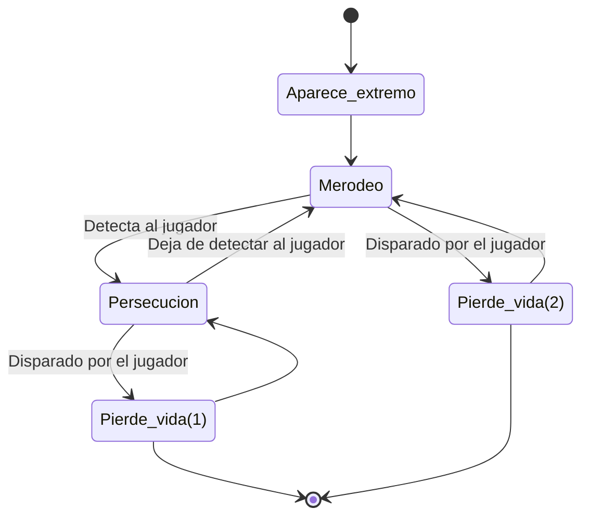

# IAV24 Proyecto final (Enchanted town)

## Índice
- [Autores](#autores)
- [Propuesta](#propuesta)
    - [Mundo](#mundo)
    - [Personaje](#personaje)
    - [Objetos](#objetos)
    - [Enemigos](#enemigos)
    - [Interfaz](#interfaz-de-usuario)
    - [Opcionales](#opcionales)
- [Punto de partida](#punto-de-partida)
- [Diseño de la solución](#diseño-de-la-solución)
    - [Mundo](#solMundo)
    - [Personaje](#solPersonaje)
    - [Objetos](#solObjetos)
    - [Enemigos](#solEnemigos)
- [Pruebas y métricas](#pruebas-y-métricas)
    - [Mundo](#pruebasMundo)
    - [Personaje](#pruebasPersonaje)
    - [Objetos](#pruebasObjetos)
    - [Enemigos](#pruebasEnemigos)
- [Producción](#producción)
- [Licencia](#licencia)
- [Referencias](#referencias)
    - [Programación](#programación)
    - [Assets](#assets)
    - [Insipraciones](#inspiraciones)

 

## Autores
- Matt Castellanos ([MattCastUCM](https://github.com/MattCastUCM))
- Pedro León ([P4179](https://github.com/P4179))

 

## Propuesta

Este proyecto forma parte de la asignatura de Inteligencia Artificial para Videojuegos del Grado en Desarrollo de Videojuegos de la UCM.

El proyecto consiste en un ***Life Simulator***, en el que el protagonista deberá ir satisfaciendo sus necesidades a través de la interacción con distintos objetos. El ambiente está basado en un pueblo medieval, en el que nuestro protagonista, un mago, debe hacer su día a día, ya sea alimentándose y durmiendo, o tratando de sobrevivir a hordas de enemigos que invadirán el pueblo. 

En este contexto se pretende implementar el uso de **árboles de comportamiento**, con los que el personaje decide qué hacer y adónde ir en cada momento, y de ***smart objects***, que son los que indican al personaje qué es lo que tiene que hacer con ellos.

El objetivo principal es sobrevivir el mayor números de días posibles. Para ello, el protagoinsta tiene que atender a sus necesidades y evitar el daño de los enemigos. De lo contrario, irá perdiendo vida y si llega a 0, perderá.

De forma más detallada, el contenido del juego se puede dividir en los siguientes apartados:

### Mundo
Hay un mundo virtual (pueblo medieval) con un esquema de división de malla navegación donde sucede toda la acción descrita anteriormente.

Además, como se ha indicado, el juego está dividido en días. Cada día dispone de un ciclo de día y noche en el que, durante la mañana, el personaje debe cubrir sus necesidades, mientras que por la noche tiene tanto que huir de los enemigos, como seguir cubriendo sus necesidades.

### Personaje
El personaje se desplaza alrededor del mapa usando la navegación automática programada con un árbol de comportamiento. En su movimiento trata de realizar sus tareas diarias (mantener sus necesidades altas) y elimina a los enemigos que amenazan el pueblo. Dispone de un área de percepción que le permite conocer los enemigos que tiene a su alrededor y actuar en consecuencia.

Para enfrentarse a los enemigos, utiliza su poder mágico. Cada punto de poder mágico equivale a un proyectil y cuando un enemigo entra en su radio de acción de lucha y tiene poder disponible, lo dispara y lo elimina. Sin embargo, los enemigos también pueden contraatacar y si entran en contacto con él, le inflingen daño. Otra forma de que pierda vida es si no atiende sus necesidades y llegan a cero. No hay una forma de curarse la vida directamente, sino que, si el hambre y la sed están altas, aumenta de forma pasiva.

Las necesidades que tiene son las siguientes:
- Hambre: baja de forma pasiva.
- Sed: baja de forma pasiva.
- Energía: baja de forma pasiva. Durante la noche esta bajada es mucho mayor.

### Objetos
Existen diferentes objetos interactuables del entorno, que le permiten al jugador aumentar alguno de sus parámetros. Están programados como *smart objects* y ninguno de ellos es consumibles. Además, para utilizar se requiere de un tiempo. Los elementos disponibles son los siguientes:
- Víveres: reducen el hambre del jugador. A pesar de que todos los objetos de este tipo tienen la misma apariencia visual, cada uno ofrece un número diferentes de puntos.
- Barriles: reducen la sed del jugador. A pesar de que todos objetos de este tipo tienen la misma apariencia visual, cada uno ofrece un número diferente de puntos.
- Torre del jugador: aumenta la energía del jugador completamente. El jugador se mete dentro de la torre a descansar y no puede sufrir daño. Sin embargo, si hay muchos enemigos alrededor del edificio, no puede seguir durmiendo por el ruido y sale de la torre.
- Libro del mago: aumenta el poder mágico del jugador completamente.

### Enemigos
Los enemigos aparecen en los límites del poblado durante la noche. Su movimiento sencillo está programa a través de un árbol de comportamiento. Consiste en merodear por todo el mapa hasta encontrarse con el jugador. Entonces, lo persiguen. Sin embargo, si este sale de su área de detección, dejan de perseguirlo y vuelven a merodear.

Los enemigos mueren de una bola de poder y realizan cierto daño al jugador al entrar en contacto con él.

### Interfaz de usuario
- FPS: arriba a la derecha. Se usa para testear el juego más adelante.
- Día actual: arriba en el centro.
- Vida del personaje: arriba a la izquierda. Está representado con una barra.
- Poder mágico: arriba a la izquierda debajo de la vida. Está representado con un número, que indica el número de bolas de poder que todavía puede lanzar el jugador.
- Necesidades: se muestran abajo a la derecha en forma de barras: hambre, sed y energía.

### Opcionales
- Existen grupos de enemigos que realizan su movimiento correspondiente, pero en vez de ir en solitario, van en grupo, en bandada.
- *Smart object* que el jugador puede utilizar para esconderse de los enemigos durante cierto tiempo.

## Punto de partida
Se parte de un proyecto de Unity 2022.3.5.f1 proporcionado por el profesor que contiene la herramienta Behavior Designer, que sirve para crear árboles de comportamiento.
Los árboles de comportamiento surgen como una mejora de las máquinas finitas de estados. Representan la ejecución de un plan (secuencia de acciones) y consiste en un árbol binario dirigido con un nodo raíz, nodos de control de flujo y nodos de ejecución (tareas). Los nodos principales de flujo son:
- Nodo selector: tiene éxito cuando uno de los hijos tiene éxito. Prueba de izquierda derecha.
- Nodo secuencia: tiene éxito cuando todos los hijos tienen éxito. Se ejecutan de izquierda a derecha.

 

## Diseño de la solución

### Mundo 
La creación del mundo se ha hecho en dos partes. Mientras que el terreno se ha creado con la herramienta Tiles de Unity, los objetos del pueblo, tanto los que funcionan como obstáculos como los interactuables, se han dispuesto de forma estratégica para que el jugador no realiza sus tareas en un intervalo de tiempo ni muy corto ni muy largo. Luego, se ha configurado la malla de navegación, que representa el terreno real por el que pueden caminar los enemigos y el jugador.

Además, se ha utilizado un borde para los objetos interactuables para que el usuario pueda reconocerlos fácilmente y conozca perfectamente lo que está haciendo el jugador.

### Personaje 
// Esquema árbol del personaje

### Objetos 

### Enemigos 
El movimiento del enemigo responde al siguiente diagrama:

 

## Pruebas y métricas
Se ha creado un plan de pruebas para comprobar el correcto funcionamiento del prototipo creado.

A la hora de la medición se especifica el número de FPS a los que se ejecutaba el programa, para comprobar que el prototipo creado no se ha basado en ninguna mala praxis de programación que empeora el rendimiento, y cuales han sido los resultados esperados.

### Mundo 
<u>Especificaciones de la máquina</u>
- Sistema operativo:
- Procesador:
- RAM:
- Tarjeta gráfica:
- VRAM:

### Personaje 
<u>Especificaciones de la máquina</u>
- Sistema operativo:
- Procesador:
- RAM:
- Tarjeta gráfica:
- VRAM:

### Objetos 
<u>Especificaciones de la máquina</u>
- Sistema operativo:
- Procesador:
- RAM:
- Tarjeta gráfica:
- VRAM:

### Enemigos 
<u>Especificaciones de la máquina</u>
- Sistema operativo:
- Procesador:
- RAM:
- Tarjeta gráfica:
- VRAM:

 

## Producción
Las tareas se han realizado y el esfuerzo ha sido repartido entre los autores. La cronología de los objetivos del grupo está documentada en la tabla situada más abajo. Para obtener más información sobre la organización y distribución de tareas, puede consultarse el desglose exhaustivo de estas en la sección de Proyectos en GitHub.

| Estado  |  Objetivo  |  Fecha  |  
|:-:|:-:|:-:|
| ✔ | Presentación y resolución de dudas | 07-05-2024 | 
| :x: | Documentación final | Semana del 13-05-2024 |
| :x: | Entrega y presentación final | | 28-05-2024 |

 

## Licencia
Matt Castellanos y Pedro León, autores de la documentación, código y recursos de este trabajo, concedemos permiso permanente a los profesores de la Facultad de Informática de la Universidad Complutense de Madrid para utilizar nuestro material, con sus comentarios y evaluaciones, con fines educativos o de investigación; ya sea para obtener datos agregados de forma anónima como para utilizarlo total o parcialmente reconociendo expresamente nuestra autoría.

Una vez superada con éxito la asignatura se prevee publicar todo en abierto (la documentación con licencia Creative Commons Attribution 4.0 International (CC BY 4.0) y el código con licencia GNU Lesser General Public License 3.0).

 

## Referencias
Los recursos de terceros utilizados son de uso público.

### Programación
- *AI for Games*, Ian Millington. Capitulo 5, apartados 5.1, 5.3, 5.4 y 5.9.

### Assets
- [Behavior Designer](https://assetstore.unity.com/packages/tools/visual-scripting/behavior-designer-behavior-trees-for-everyone-15277)
- [Personaje](https://kaylousberg.itch.io/kaykit-adventurers)
- [Enemigos](https://kaylousberg.itch.io/kaykit-skeletons)
- [Entorno](https://kaylousberg.itch.io/kaykit-medieval-builder-pack)
- [Objetos](https://kaylousberg.itch.io/kaykit-dungeon-remastered)
- [Entorno y objetos](https://kaylousberg.itch.io/kaykit-medieval-hexagon)
- [Fuente](https://fonts.google.com/specimen/Montserrat)
- [Shader outline](https://www.youtube.com/watch?v=d89qqVGUHtA)
- Unity AI Navigation
- Unity Shader Graph

### Inspiraciones
- Los Sims Medieval (2011, EA)
- Los Sims 2 (2004, EA)
- Los Sims 3 (2010, EA)
- Los Sims 4 (2014, EA)
