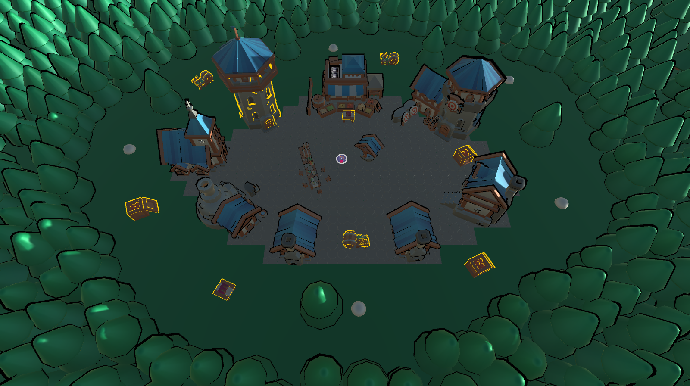
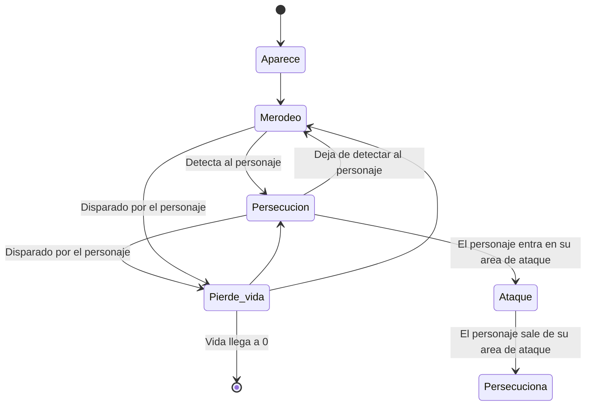

# IAV24 Proyecto final (Enchanted town) (¡¡CORREGIR DE NUEVO!!)

## Índice
- [Autores](#autores)
- [Propuesta](#propuesta)
    - [Elementos](#elementos)
        - [Mundo](#mundo)
        - [Personaje](#personaje)
        - [Objetos](#objetos)
        - [Enemigos](#enemigos)
        - [Interfaz](#interfaz-de-usuario)
        - [Opcionales](#opcionales)
    - [Apartados](#apartados)
        - [Apartado A](#apartado-a-matt)
        - [Apartado B](#apartado-b-matt)
        - [Apartado C](#apartado-c-pedro)
        - [Apartado D](#apartado-d-pedro)
        - [Apartado E](#apartado-e-matt)
- [Punto de partida](#punto-de-partida)
- [Diseño de la solución](#diseño-de-la-solución)
    - [Solución A](#solución-a)
    - [Solución B](#solución-b)
    - [Solución C](#solución-c)
    - [Solución D](#solución-d)
    - [Solución E](#solución-e)
- [Pruebas y métricas](#pruebas-y-métricas)
    - [Prueba A](#prueba-a)
    - [Prueba B](#prueba-b)
    - [Prueba C](#prueba-c)
    - [Prueba D](#prueba-d)
    - [Prueba E](#prueba-e)
- [Ampliaciones](#ampliaciones)
- [Producción](#producción)
- [Licencia](#licencia)
- [Referencias](#referencias)
    - [Assets](#assets)
    - [Herramientas](#herramientas)
    - [Insipraciones](#inspiraciones)
    - [Programación](#programación)

## Autores
- Matt Castellanos ([MattCastUCM](https://github.com/MattCastUCM))
- Pedro León ([P4179](https://github.com/P4179))

## Propuesta

Este proyecto forma parte de la asignatura de Inteligencia Artificial para Videojuegos del Grado en Desarrollo de Videojuegos de la UCM.

El proyecto consiste en un ***Life Simulator***, en el que el protagonista deberá ir satisfaciendo sus necesidades a través de la interacción con distintos objetos. El ambiente está basado en un pueblo medieval, en el que nuestro protagonista, un mago, debe hacer su día a día, ya sea alimentándose y durmiendo, o tratando de sobrevivir a hordas de enemigos que invadirán el pueblo. 

En este contexto se pretende implementar el uso de **árboles de comportamiento**, con los que el personaje decide qué hacer y adónde ir en cada momento, y de ***smart objects***, que son los que indican al personaje qué es lo que tiene que hacer con ellos.

El objetivo principal es sobrevivir el mayor números de días posibles. Para ello, el protagoinsta tiene que atender a sus necesidades y evitar el daño de los enemigos. De lo contrario, irá perdiendo vida y si llega a 0, perderá.

### Elementos

De forma más detallada, el contenido del juego se puede dividir en los siguientes apartados:

#### Mundo
Hay un mundo virtual (pueblo medieval) con un esquema de división de malla navegación donde sucede toda la acción descrita anteriormente.

Además, como se ha indicado, el juego está dividido en días. Cada día dispone de un ciclo de día y noche en el que, durante la mañana, el personaje debe cubrir sus necesidades, mientras que por la noche tiene tanto que huir de los enemigos, como seguir cubriendo sus necesidades.

#### Personaje
El personaje se desplaza alrededor del mapa usando la navegación automática programada con un árbol de comportamiento. En su movimiento trata de realizar sus tareas diarias (mantener sus necesidades altas) y elimina a los enemigos que amenazan el pueblo. Dispone de un área de percepción que le permite conocer los enemigos que tiene a su alrededor y actuar en consecuencia.

Para enfrentarse a los enemigos, utiliza su poder mágico. Cada punto de poder mágico equivale a un proyectil y cuando un enemigo entra en su radio de acción de lucha y tiene poder disponible, lo dispara y lo elimina. Sin embargo, los enemigos también pueden contraatacar y si entran en contacto con él, le inflingen daño. Otra forma de que pierda vida es si no atiende sus necesidades y llegan a cero. No hay una forma de curarse la vida directamente, sino que, si el hambre y la sed están altas, aumenta de forma pasiva.

Las necesidades que tiene son las siguientes:
- Hambre: baja de forma pasiva.
- Sed: baja de forma pasiva.
- Energía: baja de forma pasiva. Durante la noche esta bajada es mucho mayor.

#### Objetos
Existen diferentes objetos interactuables del entorno, que le permiten al personaje aumentar alguno de sus parámetros. Están programados como *smart objects* y ninguno de ellos es consumibles. Además, para utilizar se requiere de un tiempo. Los elementos disponibles son los siguientes:
- Víveres: reducen el hambre del personaje. A pesar de que todos los objetos de este tipo tienen la misma apariencia visual, cada uno ofrece un número diferentes de puntos.
- Barriles: reducen la sed del personaje. A pesar de que todos objetos de este tipo tienen la misma apariencia visual, cada uno ofrece un número diferente de puntos.
- Torre del personaje: aumenta la energía del personaje completamente. El personaje se mete dentro de la torre a descansar y no puede sufrir daño. Sin embargo, si hay muchos enemigos alrededor del edificio, no puede seguir durmiendo por el ruido y sale de la torre.
- Libro del mago: aumenta el poder mágico del personaje completamente.

#### Enemigos
Los enemigos aparecen en los límites del poblado durante la noche. Su movimiento sencillo está programa a través de un árbol de comportamiento. Consiste en merodear por todo el mapa hasta encontrarse con el personaje. Entonces, lo persiguen. Sin embargo, si este sale de su área de detección, dejan de perseguirlo y vuelven a merodear.

Los enemigos mueren de una bola de poder y realizan cierto daño al personaje al entrar en contacto con él.

#### Interfaz de usuario
- FPS: arriba a la derecha. Se usa para testear el juego más adelante.
- Día actual: arriba en el centro.
- Vida del personaje: arriba a la izquierda. Está representado con una barra.
- Poder mágico: arriba a la izquierda debajo de la vida. Está representado con un número, que indica el número de bolas de poder que todavía puede lanzar el personaje.
- Necesidades: se muestran abajo a la derecha en forma de barras: hambre, sed y energía.

#### Opcionales
- Existen grupos de enemigos que realizan su movimiento correspondiente, pero en vez de ir en solitario, van en grupo, en bandada.
- *Smart object* que el personaje puede utilizar para esconderse de los enemigos durante cierto tiempo.
- Movimiento manual con el clic derecho usando la malla de navegación.

### Apartados

Una vez explicados todos los elementos del juego, siguiendo el [guión del proyecto](https://narratech.com/es/docencia/prueba/), se estructura de la siguiente manera:

#### Apartado A (Matt)
Hay un **mundo virtual** (el pueblo) con un esquema de división por **malla de navegación** generado con la herramienta ***AI Navigation*** de Unity, en el que se encuentran todos los elementos descritos anteriormente. La cámara es fija, y enfocará en todo momento a todo el escenario, desde un ángulo en el que se puede ver prácticamente todo lo que hace el personaje en todo momento. 

#### Apartado B (Matt)
Hay un **ciclo de día y noche** con el que se van contando los días que lleva vivo el personaje. El sol irá saliendo y poniéndose según la hora del día, y por la noche aparecerán **enemigos** cada cierto tiempo a las afueras del pueblo.

#### Apartado C (Pedro)
El personaje cuenta con una **barra de vida**, que disminuirá si los enemigos entran en contacto con él. Por otro lado, también cuenta con **poder mágico**, que le permitirá **dispararle** a los enemigos que se acerquen a él a cierta distancia. El **poder mágico** restante estará indicado por el número restante de proyectiles que puede disparar. Además, se recargará usando un ***smart object***.

#### Apartado D (Pedro)
El personaje cuenta con unas **necesidades**, indicando qué tan satisfechas están mediante unas barras. Estas barras se van vaciando con el tiempo, por lo que tendrá que usar los ***smart objects*** correspondientes para satisfacerlas. Si es de noche, la barra de energía se vaciará más rápidamente, y el personaje no podrá dormir si hay demasiados enemigos cerca de él. Si la barra de vida no está al completo, esta se irá rellenando poco a poco si sus necesidades están satisfechas.

#### Apartado E (Matt)
Tanto los enemigos como los personajes están controlados por **árboles de comportamiento** complejos, programados mediante ***Behavior Designer***. El personaje se acercará a los distintos ***smart objects*** según sus necesidades para posteriormente usarlos, y tratará de huir de los enemigos que se acerquen a él, evadiéndolos tanto a ellos como a los obstáculos del mapa. Por otro lado, los enemigos merodearán por el mapa hasta que encuentren con la vista al personaje, comenzando a perseguirlo una vez lo detecten y volviendo a merodear si lo pierde.

<br>

## Punto de partida
Se parte de un proyecto de Unity 2022.3.5.f1 proporcionado por el profesor que contiene la herramienta ***Behavior Designer***, que sirve para crear árboles de comportamiento.
Los árboles de comportamiento surgen como una mejora de las máquinas finitas de estados. Representan la ejecución de un plan (secuencia de acciones) y consiste en un árbol binario dirigido con un nodo raíz, nodos de control de flujo y nodos de ejecución (tareas). Los nodos principales de flujo son:
- Nodo selector: tiene éxito cuando uno de los hijos tiene éxito. Prueba de izquierda derecha.
- Nodo secuencia: tiene éxito cuando todos los hijos tienen éxito. Se ejecutan de izquierda a derecha.

<br>

## Diseño de la solución

### Solución A
La creación del mundo se ha hecho en dos partes. Mientras que el terreno se ha creado con la herramienta Tiles de Unity, los objetos del pueblo, tanto los que funcionan como obstáculos como los interactuables, se han dispuesto de forma estratégica para que el personaje no realiza sus tareas en un intervalo de tiempo ni muy corto ni muy largo. Luego, se ha configurado la malla de navegación, que representa el terreno real por el que pueden caminar los enemigos y el personaje.

Además, se ha utilizado un borde para los objetos interactuables para que el usuario pueda reconocerlos fácilmente y conozca perfectamente lo que está haciendo el personaje.



### Solución B
El `LevelManager` es el gestor encargado de:
- Ciclo de día y noche &rarr; para hacer un cambio visual, se hace que la luz cambie de color según un grandiente y que gire alrededor del mundo como si de un sol se tratase, de modo que las sombras cambian de posición dependiendo de la hora del día.
- Spawn de los enemigos &rarr; existen varios puntos en los que que a partir de una horas establecidas en el día aparecen los tipos de enemigos asignados. Además, se lleva un conteo de los enemigos que hay en el mapa para que no se generen más si ya hay demasiados.

### Solución C

### Solución D

### Solución E
El movimiento del enemigo responde al siguiente diagrama:



Además, durante la persecución también se realiza un control de llegada, implementado de manera que funcione como un nodo de **Behavior Designer**. El pseudocódigo del algoritmo es el siguiente:
```
class Arrival:
    # Target object to arrive at
    target : GameObject
    # Distance at which to start slowing down.
    slowDist: float
    # Distance at which the object is considered to have reached the target
    stopDist : float

    # Components that belong to the object
    transform: Transform
    agent: NavMeshAgent
    lastVel: Vector3
    latVel = Vector3(0, 0, 0)

    function update() -> TaskStatus:
        # Calculate distance to target
        dist : float 
        dist = Distance(target.position, transform.position)

        # If the distance is enough to start slowing down
        if dist <= slowDist:
            # If the distance is enough to stop, the node returns success
            if dist <= stopDist:
                agent.ResetPath()
                return Success
            # Slows down the agent depending on the distance to the target. Returns running because the node isn't finished yet
            else:
                ratio : float
                ratio = dist / slowDist
                agent.velocity = lastVel * ratio
                agent.velocity.Normalize()
                return Running
            
        # If the distance is not enough, the agent's last velocity keeps updating and the node returns failure
        lastVel = navMesh
        return Failure

```
<br>


El movimiento del personaje responde al siguiente diagrama:

```
```

<br>

## Pruebas y métricas
Se ha creado un plan de pruebas para comprobar el correcto funcionamiento del prototipo creado.

A la hora de la medición se especifica el número de FPS a los que se ejecutaba el programa, para comprobar que el prototipo creado no se ha basado en ninguna práctica de programación errónea que empeora el rendimiento, y cuales han sido los resultados esperados.

### Prueba A
Este apartado está enfocado en probar el correcto funcionamiento del mundo, sobre todo que la malla de navegación está bien creada y se pueden llegar todos los lugares.

<ins>Especificaciones de la máquina</ins>
- Sistema operativo:
- Procesador:
- RAM:
- Tarjeta gráfica:
- VRAM:

| Prueba | Descripción | Atributos | Resultados esperados | Resultados | FPS |
|:-:|:-:|:-:|:-:|:-:|:-:|
| A1 | Hacer que el personaje se dirija a cada uno de los extremos del mapa desde el centro del pueblo. | Spawn de enemigos desactivado | Se espera que el personaje pueda llegar a cada uno de los extremos y no se quede atascado en ningún sitio usando el movimiento manual. |  |

### Prueba B
El objetivo de esta prueba es testear los cambios en el mundo y cómo estos afectan al spawn de enemigos, de modo que se puedan generar enemigos a lo largo de todos los días sin que afecte en ningún momento al flujo del juego.

<ins>Especificaciones de la máquina</ins>
- Sistema operativo:
- Procesador:
- RAM:
- Tarjeta gráfica:
- VRAM:

| Prueba | Descripción | Atributos | Resultados esperados | Resultados | FPS |
|:-:|:-:|:-:|:-:|:-:|:-:|
| B1 | Comprobar que el ciclo de día y noche funciona correctamente y que los enemigos spawnean durante la noche | Velocidad x2 <br> Personaje desactivado <br> Esperar a que pasen 10 días | Se espera que los 10 días sucedan con normalidad, alternándose el ciclo día-noche perfectamente. Además, como los enemigos merodean, terminarán llegando al pueblo y no se impedirá el avance de los nuevos enemigos que spawneeen por llenar los puntos de spawn |  |  |

### Prueba C
<ins>Especificaciones de la máquina</ins>
- Sistema operativo:
- Procesador:
- RAM:
- Tarjeta gráfica:
- VRAM:

| Prueba | Descripción | Atributos | Resultados esperados | Resultados | FPS |
|:-:|:-:|:-:|:-:|:-:|:-:|
| C1 |  |  |  |  |  |

### Prueba D
<ins>Especificaciones de la máquina</ins>
- Sistema operativo:
- Procesador:
- RAM:
- Tarjeta gráfica:
- VRAM:

| Prueba | Descripción | Atributos | Resultados esperados | Resultados | FPS |
|:-:|:-:|:-:|:-:|:-:|:-:|
| D1 |  |  |  |  |  |

### Prueba E
<ins>Especificaciones de la máquina</ins>
- Sistema operativo:
- Procesador:
- RAM:
- Tarjeta gráfica:
- VRAM:

| Prueba | Descripción | Atributos | Resultados esperados | Resultados | FPS |
|:-:|:-:|:-:|:-:|:-:|:-:|
| E1 |  |  |  |  |  |

<br>

## Ampliaciones
Se han realizado las siguientes ampliaciones:
- Movimiento manual del personaje con clic derecho usando la malla de navegación. Se ha lanzado un raycast con la posición del mouse para saber a que punto tiene que dirigirse.

## Producción
Las tareas se han realizado y el esfuerzo ha sido repartido entre los autores. La cronología de los objetivos del grupo está documentada en la tabla situada más abajo. Para obtener más información sobre la organización y distribución de tareas, puede consultarse el desglose exhaustivo de estas en la sección de Proyectos en GitHub.

| Estado  |  Objetivo  |  Fecha  |  
|:-:|:-:|:-:|
| ✔ | Presentación y resolución de dudas | 07-05-2024 | 
| ✔ | Documentación final | Semana del 13-05-2024 |
| ✔ | Presentación | 28-05-2024 |
| :x: | Entrega final | 31-05-2024 |

<br>

## Licencia
Matt Castellanos y Pedro León, autores de la documentación, código y recursos de este trabajo, concedemos permiso permanente a los profesores de la Facultad de Informática de la Universidad Complutense de Madrid para utilizar nuestro material, con sus comentarios y evaluaciones, con fines educativos o de investigación; ya sea para obtener datos agregados de forma anónima como para utilizarlo total o parcialmente reconociendo expresamente nuestra autoría.

Una vez superada con éxito la asignatura se prevee publicar todo en abierto (la documentación con licencia Creative Commons Attribution 4.0 International (CC BY 4.0) y el código con licencia GNU Lesser General Public License 3.0).

<br>

## Referencias
Los recursos de terceros utilizados son de uso público.

### Assets
- [Personaje](https://kaylousberg.itch.io/kaykit-adventurers)
- [Enemigos](https://kaylousberg.itch.io/kaykit-skeletons)
- [Entorno](https://kaylousberg.itch.io/kaykit-medieval-builder-pack)
- [Objetos](https://kaylousberg.itch.io/kaykit-dungeon-remastered)
- [Entorno y objetos](https://kaylousberg.itch.io/kaykit-medieval-hexagon)
- [Fuente](https://fonts.google.com/specimen/Montserrat)

### Herramientas
- [Behavior Designer](https://assetstore.unity.com/packages/tools/visual-scripting/behavior-designer-behavior-trees-for-everyone-15277)
- Unity AI Navigation
- Unity Shader Graph


### Inspiraciones
- Los Sims Medieval (2011, EA)
- Los Sims 2 (2004, EA)
- Los Sims 3 (2010, EA)
- Los Sims 4 (2014, EA)

### Programación
- *AI for Games*, Ian Millington. Capitulo 5, apartados 5.1, 5.3, 5.4 y 5.9.
- [Shader outline](https://www.youtube.com/watch?v=d89qqVGUHtA)
- [Day & Night Cycle](https://www.youtube.com/watch?v=m9hj9PdO328)
